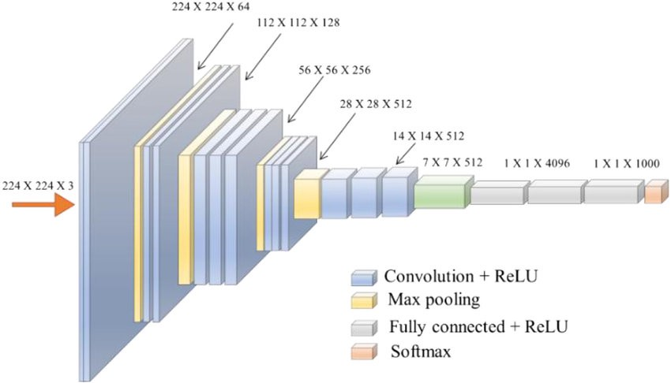

# - `Retraining a Model`
__Resumen del proyecto__: Uso del poder de computo de las maquinas de AWS para poder entrenar una red neuronal.

Comentarios:
- no hay desarrollo back o front. La idea es entrenarla red en una computadora potente para que nos realice buenas predicciones.


Estructura del proyecto:
```
|-- AI-resnet_retraining
    |-- AWS
    |-- documentacion
    |-- machine learning
    |-- README.md
```
## -- `machine learning part`
- Primero hacer todos los experimentos necesarios en _Google Colab_ ([aqui](https://www.tensorflow.org/tutorials/images/transfer_learning) ya se hizo ello). Cuando ya se tenga claro que modelo usar para dar solucion al problema se pasa al siguiente paso.
- en el archivo _transfer_learning.py_ solo se a puesto el codigo de computo (nada de ploteo de imagenes o print, cosas que se usan para evaluar el modelo).

Adicionales
- El algoritmo de machine learning de este proyecto se base en [este](https://www.tensorflow.org/tutorials/images/transfer_learning) ejemplo oficial de tensorflow. Se usara el modelo _Imagenet_.

- [Aqui](https://keras.io/api/applications/) hay informacion sobre otra arquitectura (Resnet50).
- Diferencia entre [modelos secuenciales](https://www.tensorflow.org/guide/keras/sequential_model) y [modelos no secuenciales](https://www.tensorflow.org/guide/keras/functional).
- [Link](https://arxiv.org/pdf/1801.04381.pdf) del paper oficial de MobileNetV2.

## -- `Infraestructure as a Service`
- ir al servicio _EC2_ de _AWS_ y crear un _key pair_ y llamarle _key-pair-name_.
- Subir el archivo _cloudformation_file.yml_ a _Cloudformation_. Luego crear el stack.
- ir a _EC2_ y buscar la instancia creada. Ejecutar:
```bash
touch initialize_EC2.sh
nano initialize_EC2.sh
```
- copiar el contenido del archivo _initialize_EC2.sh_ y pegarlo en el archivo con el mismo nombre dentro de la instancia _EC2_. Luego ejecutar:
```bash
bash initialize_EC2.sh
```
## -- `Conexion remota`

Seguir [este](https://code.visualstudio.com/docs/remote/troubleshooting#_improving-your-security-with-a-dedicated-key) tutorial oficial para usar _Remote - SSH_. Primero tienes que crear tu servicio en AWS.

- En _Remote Explorer_ (al costado de _SSH TARGETS_) hay un _+_. Poner mouse encima y aparece el mensaje _Add new_. Dar click. ([fuente](https://code.visualstudio.com/docs/remote/ssh#_remember-hosts-and-advanced-settings))
- poner lo siguiente _nombre@dominio_. Ejemplo:
```
ubuntu@ec2-52-91-214-209.compute-1.amazonaws.com
```
- seleccionar la ruta _/home/josue/.ssh/config_ ([fuente](https://code.visualstudio.com/docs/remote/troubleshooting#_improving-your-security-with-a-dedicated-key))
- _Abrir configuracion_
- Agregar lo siguiente
```
IdentityFile /(ruta donde esta el public key)
```
- hay que modificar los permisos (asi lo recomienda AWS).
```
chmod 400 _path de key_
```
- Usar el icono del la extension y conectar directamente.

## -- `docker`
- https://hub.docker.com/_/python
- https://docs.docker.com/engine/reference/commandline/run/#full-container-capabilities---privileged

```bash
cd (ruta de repo)

docker-compose up -d

docker run -t -i --privileged django-image bash
```

- ssh -i ~.ssh\id_ed25519.pub josueelias9@ec2-18-218-105-152.us-east-2.compute.amazonaws.com
- clave aaa
