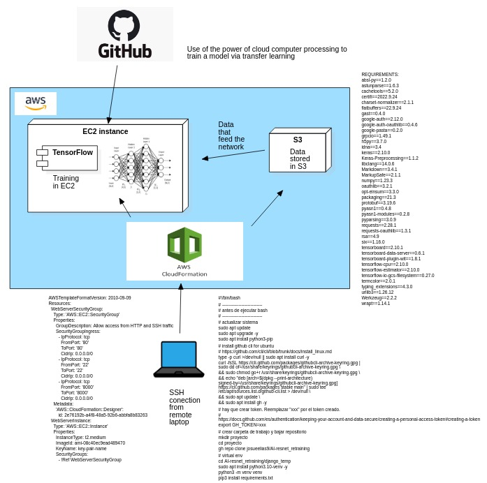

# - `Retraining a Model`
- Uso del poder de computo de las maquinas de AWS para poder entrenar una red neuronal. 

- todo el computo se realizara en un contenedor.
- La red tiene que ser capaz de distinguir:
  - parte interna de un vehiculo 
    
  - parte externa de un vehiculo 
    


Estructura del proyecto:
```
|-- AI-resnet_retraining
    |-- AWS
    |-- documentacion
    |-- machine learning
    |-- README.md
```
---
## -- `Infraestructura`
### --- `IaS`
- ir al servicio _EC2_ de _AWS_ y crear un _key pair_ y llamarle _key-pair-name_.
- Subir el archivo _cloudformation_file.yml_ a _Cloudformation_. Luego crear el stack.
### --- `Conexion remota`

Seguir [este](https://code.visualstudio.com/docs/remote/troubleshooting#_improving-your-security-with-a-dedicated-key) tutorial oficial para usar _Remote - SSH_. Primero tienes que crear tu servicio en AWS.

- En _Remote Explorer_ (al costado de _SSH TARGETS_) hay un _+_. Poner mouse encima y aparece el mensaje _Add new_. Dar click. ([fuente](https://code.visualstudio.com/docs/remote/ssh#_remember-hosts-and-advanced-settings))
- poner lo siguiente _nombre@dominio_. Ejemplo:
```
ubuntu@ec2-52-91-214-209.compute-1.amazonaws.com
```
- seleccionar la ruta _/home/josue/.ssh/config_ ([fuente](https://code.visualstudio.com/docs/remote/troubleshooting#_improving-your-security-with-a-dedicated-key))
- _Abrir configuracion_
- Agregar lo siguiente
```
IdentityFile /(ruta donde esta el public key)
```
- hay que modificar los permisos (asi lo recomienda AWS).
```
chmod 400 _path de key_
```
- Usar el icono del la extension y conectar directamente.

### --- `entorno de maquina`
- son varios pasos (_initialize_EC2.sh_)
  1. atachear volumen
  2. instalar docker
  3. levantar contenedor de tensorflow

---
## -- `machine learning part`
### --- `parte 2`
#### ---- `entrenamiento`
- poner todos nuestros datos en la carpeta _/data_
```
# https://linuxhint.com/extract_rar_files_ubuntu/

cd /data

# si es rar:
sudo apt install unrar
unrar x <comprimido.rar>

# si es zip:
!sudo apt-get install unzip
!unzip <comprimido.zip>
```
- Partimos de [esta](https://www.tensorflow.org/tutorials/images/transfer_learning) plantilla oficial.
- ir a la ruta _/spliting/como_dan_. Asi es como debemos recibir nuestros datos:
```
|-- como_dan
    |-- class_1
    |-- class_2
```
- prepara una carpeta y poner lo siguiente:
```
|-- como_debe_ser
    |-- train
        |-- class_1
        |-- class_2
    |-- validation
        |-- class_1
        |-- class_2
    |-- vectorize.py
```
- ejecutar _split_dataset.py_ y automaticamente se dividiran lass imagenes en una relacion 20/80. Luego zipear la carpeta _como_debe_ser_.
#### ---- `prediccion`

- How to use save only the best weights? (search for _save_best_only_) [Link](https://www.tensorflow.org/guide/keras/train_and_evaluate#checkpointing_models)
- How to dynamically label the group of weights that we save? (search for _val_loss:.2f_) [Link](https://www.tensorflow.org/api_docs/python/tf/keras/callbacks/ModelCheckpoint)

### --- `Links oficiales`
- Ejemplo oficial de transfer learning usando el modelo el algoritmo mobilNet [Link](https://www.tensorflow.org/tutorials/images/transfer_learning)
- Informacion de otra arquitectura similar (Resnet50) [Link](https://keras.io/api/applications/)
- Diferencia entre [modelos secuenciales](https://www.tensorflow.org/guide/keras/sequential_model) y [modelos no secuenciales](https://www.tensorflow.org/guide/keras/functional)
- Paper oficial de MobileNetV2 [Link](https://arxiv.org/pdf/1801.04381.pdf) 
---
## -- `observacion`
- primero levantar servidor linux con docker y docker compose
- levantar imagen y contenedor con todas las dependencias
- dentro de contenedor instalar git para descargar proyecto